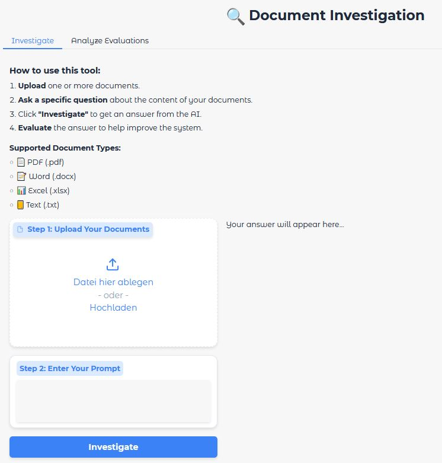

# Document Investigation AI

This interactive <i>Gradio</i> application allows users to upload documents of type pdf, word doc, txt and excel. Then the user can querying them using the Google Gemini API via user input prompts. Until the LLM output prompt is created, the specific UI text message "Your answer will appear here..." changes its black colour to light grey. This can take a few seconds. At that position, the final result and the associated evaluation window with its 'yes' or 'no' radio buttons pops up.<br>
If a document with a wrong type shall be uploaded (e.g. png image), an error message appeared to inform the user which kind of document types are possible.

As a starting point for this use case, a single script PoC file has been generated. An example .pdf document about a movie dataset has been added to get a first manual impression of application and evaluation usage.

Afterwards, this PoC approach has been transfered to a project level. The project application features a robust architecture regarding SOLID principles, comprehensive exception handling and logging. The evaluation feature can be monitored by a <i>Datasette</i> call to get the entire stored evaluation information of an <i>SQLite</i> database.<br>
Furthermore, a unit test suite for database handling and some UI workflows as test examples are added.

As a prerequisite, you need a Google Gemini API Key. Put it in your own created .env file (same level as doc_investigator_project) as <i>export GOOGLE_API_KEY='your-own-key'</i> and source it or use the export CLI command mentioned below.

## Application User Interface

<br>

## Project Structure
doc_investigator_project/<br>
├── logs/&emsp;&emsp;&emsp;&emsp;&emsp;&emsp;&emsp;&ensp;&nbsp;# Includes log files<br>
├── src/<br>
│   ├── doc_investigator/<br>
│   |   ├── __init__.py<br>
│   |   ├── app.py&emsp;&emsp;&emsp;&emsp;&emsp;&ensp;&ensp;# Contains the AppUI class (Gradio logic)<br>
│   |   ├── config.py&emsp;&emsp;&emsp;&emsp;&ensp;&nbsp;# Contains the Config dataclass<br>
│   |   ├── database.py&emsp;&emsp;&emsp;&ensp;# Contains the DatabaseManager class<br>
│   |   ├── documents.py&emsp;&emsp;&ensp;# Contains all DocumentLoader strategies<br>
│   |   ├── services.py&emsp;&emsp;&emsp;&emsp;# Contains the GeminiService class<br>
│   |   └── logging_config.py&emsp;# Contains the Loguru setup function<br>
|   └── main.py&emsp;&emsp;&emsp;&emsp;&nbsp;# Main entry point to run the application<br>
├── tests/<br>
│   ├── __init__.py<br>
│   └── test_database.py&emsp;&ensp;# Pytest tests for the DatabaseManager<br>
│   └── test_documents.py&ensp;# Pytest tests for DocumentProcessor validation<br>
│   └── test_app.py&emsp;&emsp;&emsp;&emsp;# Pytest tests for the AppUI logic (reset workflow)<br>
├── pytest.ini&emsp;&emsp;&emsp;&emsp;&emsp;&emsp;&nbsp;# Config file tells pytest where to find source code<br>
├── requirements.txt&emsp;&emsp;&ensp;# Project dependencies<br>
└── README.md&emsp;&emsp;&emsp;&emsp;# Instructions for setup and usage<br>

## How to Generate and Run the Code
### Setup

1.  **Clone the remote repository to your local directory**
    ```bash
    git clone https://github.com/IloBe/doc_investigator_project.git
    cd doc_investigator_project
    ```

2.  **Create a virtual environment and install dependencies**
    ```bash
    python -m venv .venv
    source .venv/bin/activate  # On Windows, use `venv\Scripts\activate`
    pip install -r requirements.txt
    ```

3.  **Set your API Key**
    The application will prompt you for your Google Gemini API Key on first run. For a non-interactive setup, you can set it as an environment variable:
    ```bash
    export GOOGLE_API_KEY="your_api_key_here"
    ```

### Run the Application
Execute the main entry point script for the entire multi-file application with Uvicorn as lightning-fast ASGI server:
Being in the projects directory, call main.py file on terminal:
```bash
python3 src/main.py
```

Execute the PoC script file, which has been the starting point of the project to get an impression of the application:
```bash
python3 doc_investigator_gradio_PoC.py
```
The application or the PoC script run on local URL: http://0.0.0.0:8000 or http://127.0.0.1:7860.

Regarding the entire multiple-file application, log files for each session will be created in the logs/ directory.
As retention policy a maximum of 5 log files is set (configured in config.py).
For the PoC script file simple CLI prints are added only.

### Run the Tests
Starting from the root path, where the .venv is located, to ensure the components are working correctly, run the <i>Pytest</i> test suite using pytest CLI command:
```bash
pytest
```
It will use <i>pytest-asyncio</i> to correctly run both synchronous and asynchronous tests, providing a complete and robust testing suite for our application.

### Observe the Logged Data
After using the entire project applicatoin, you can explore the doc_investigator_prod.db database with Datasette:
```bash
datasette doc_investigator_prod.db --open
```

In the application, general information is given with its second tab. This CLI command will launch a web server and open a new browser tab. You will see a fully interactive dashboard for your database. You can:
-    Click on the interactions table to view all your logged data
-    Sort and filter columns with a few clicks
-    Run custom SQL queries to perform more complex analysis (e.g. SELECT * FROM interactions WHERE evaluation LIKE '%Yes%')
-    Export data to CSV or JSON
