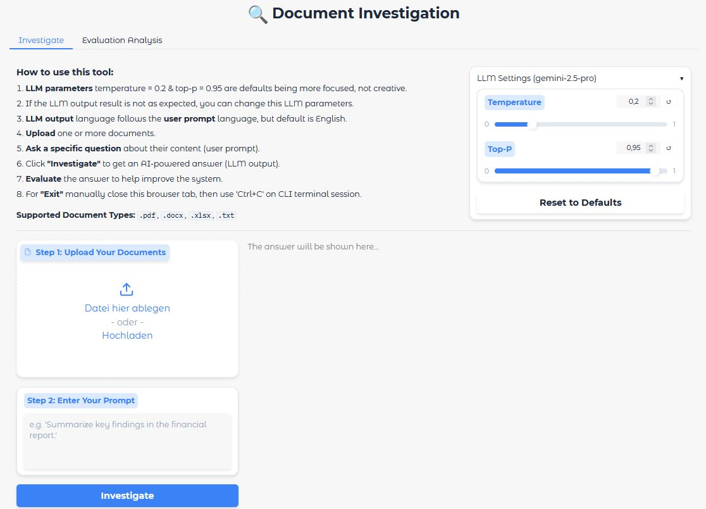
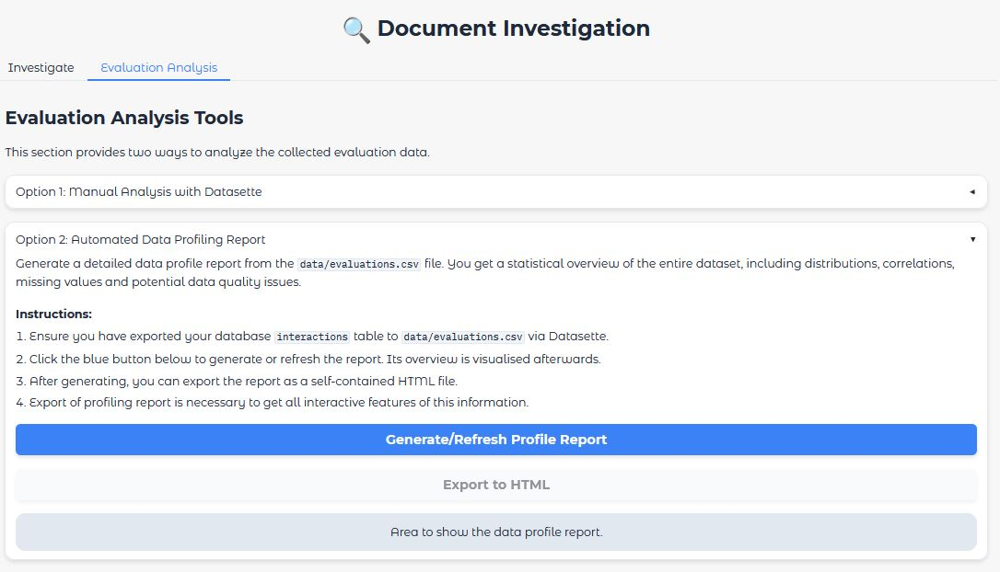

# Document Investigation AI

This interactive **<i>Gradio</i> application** allows users to upload documents of type <i>pdf, word doc, txt and excel</i> on the first **<i>Investigation'</i>** tab. Then the user can querying the document content using the <i>Google Gemini API</i> via user input prompts. If the user prompt task is not allowed, the user will be informed about it. In the positive case: Until the LLM output prompt is created, the specific UI text message "Your answer will appear here..." changes its colour to light grey. This can take a few seconds. At the same position, the final LLM result, the associated user evaluation window with its 'yes' or 'no' radio buttons and the optional task to add a reason for the evaluation passed decison pops up.<br>
If a document with a wrong type shall be uploaded (e.g. png image), an error message appeared to inform the user which kind of document types are possible.<br>
Having costs in mind, before the LLM starts creating an answer, a <i>simple hashkey cache</i> table is reviewed if a real answer already exists for this specific document and question. If yes, this answer will be shown. If no, the LLM tries to find an answer. 

The second **<i>'Evaluation Analysis'</i>** tab is used for the required evaluation analysis workflow tasks. As a first option, the investigation and evaluation information triggered on the first tab can be monitored by a <i>Datasette</i> call to get the entire stored information of an <i>SQLite</i> database. This data shall be stored as <i>'evaluation.csv'</i> file in projects <i>'data'</i> directory. Afterwards as a second option, it is possible to create a **data profiling report**. Its overview is shown on that page, but not all interactive features can be triggered, therefore you can export this data report as an <i>'.html'</i> file into the <i>'reports'</i> directory to use all its features on your usual browser. 

As a starting point for this use case, a single script PoC file has been generated. An example .pdf document about a movie dataset has been added to get a first manual impression of application and evaluation usage.

Afterwards, this **PoC** approach has been transfered to an **MVP** project level. The project application features a robust architecture regarding SOLID principles, comprehensive exception handling and logging. Furthermore, a unit test suite for database handling, some UI workflows and basic LLM behaviour as test examples are added. Have in mind, that because of the LLM tests, we will not always reach a 100% test coverage.

As a prerequisite, you need a **Google Gemini API Key**. Put it in your own created .env file (same level as doc_investigator_project) as <i>export GOOGLE_API_KEY='your-own-key'</i> and source it or use the export CLI command mentioned below.

Additionally, create private certificate files, because main call is using for browser app:<br>
- ssl_keyfile = "./key.pem",<br>
- ssl_certfile = "./cert.pem"

You explicitly have to accept the risk message the browser will show after starting with localhost and port number.

## Technical Details
Further, detailed technical project and software information can be found in the second README file of the project folder **doc_investigator_project**.
As a summary, the Gradio application works with [burr](https://burr.dagworks.io/) and its state machine concept to separate the UI from business logic.

## Application User Interface - Overview

<br>

## MVP Project Structure
doc_investigator_project/<br>
├── data/&emsp;&emsp;&emsp;&emsp;&emsp;&emsp;&emsp;&emsp;&emsp;&emsp;&emsp;&nbsp;# Includes datasette evaluations.csv file<br>
├── logs/&emsp;&emsp;&emsp;&emsp;&emsp;&emsp;&emsp;&emsp;&emsp;&emsp;&emsp;&nbsp;# Includes log files<br>
├── reports/&emsp;&emsp;&ensp;&emsp;&emsp;&emsp;&emsp;&emsp;&emsp;&emsp;&nbsp;# Includes interactive .html profiling files of eval data<br>
├── src/<br>
│&emsp;&ensp;   ├── doc_investigator_strategy_pattern/<br>
│&emsp;&ensp;   |&emsp;&ensp;   ├── __init__.py<br>
│&emsp;&ensp;   |&emsp;&ensp;    ├── app.py&emsp;&emsp;&emsp;&emsp;&emsp;&ensp;&ensp;# Contains the AppUI class (Gradio logic)<br>
│&emsp;&ensp;   |&emsp;&ensp;    ├── config.py&emsp;&emsp;&emsp;&emsp;&ensp;&nbsp;# Contains the Config dataclass<br>
│&emsp;&ensp;   |&emsp;&ensp;    ├── database.py&emsp;&emsp;&emsp;&ensp;# Contains the DatabaseManager class<br>
│&emsp;&ensp;   |&emsp;&ensp;    ├── documents.py&emsp;&emsp;&ensp;# Contains all DocumentLoader strategies<br>
│&emsp;&ensp;   |&emsp;&ensp;    ├── services.py&emsp;&emsp;&emsp;&emsp;# Contains the GeminiService class<br>
│&emsp;&ensp;   |&emsp;&ensp;    ├── state_machine.py&emsp;&ensp;# Contains the Burr state machine logic<br>
│&emsp;&ensp;   |&emsp;&ensp;    └── logging_config.py&emsp;# Contains the Loguru setup function<br>
|&emsp;&ensp;   ├── main.py&emsp;&emsp;&emsp;&emsp;&emsp;&emsp;&emsp;&nbsp;&nbsp;# Main entry point to run the application<br>
|&emsp;&ensp;   └── visualise_flow.py&ensp;&ensp;&emsp;&emsp;&ensp;&nbsp;# Burr feature to creates the workflow diagram<br>
├── tests/<br>
│&emsp;&ensp;   ├── __init__.py<br>
│&emsp;&ensp;   ├── conftest.py&emsp;&emsp;&emsp;&emsp;&emsp;&emsp;# Stops external FilterWarnings thrown in pytest run terminal<br>
│&emsp;&ensp;   ├── test_analysis.py&emsp;&ensp;&ensp;&emsp;&emsp;# Pytest tests for the data analysis use cases<br>
│&emsp;&ensp;   ├── test_database.py&emsp;&ensp;&emsp;&emsp;# Pytest tests for the DatabaseManager<br>
│&emsp;&ensp;   ├── test_documents.py&ensp;&emsp;&emsp;# Pytest tests for DocumentProcessor validation<br>
│&emsp;&ensp;   ├── test_app.py&emsp;&emsp;&emsp;&emsp;&emsp;&ensp;# Pytest tests for the AppUI logic (reset workflow)<br>
│&emsp;&ensp;   ├── test_llm_behaviour.py&ensp;&ensp;# Pytest tests for LLM behaviour validation<br>
│&emsp;&ensp;   └── test_state_machine.py&ensp;&ensp;# Pytest tests for Burr state machine<br>
├── cert.pem&emsp;&emsp;&emsp;&emsp;&emsp;&emsp;&emsp;&emsp;&emsp;&ensp;# your own created file<br>
├── key.pem&emsp;&emsp;&emsp;&emsp;&emsp;&emsp;&emsp;&emsp;&emsp;&ensp;# your own created file<br>
├── otel-collector-config.yaml&nbsp;&emsp;&ensp;# Needed for Burr dependencies (OpenTelemetry)<br>
├── docker-compose.yml&emsp;&emsp;&emsp;&nbsp;&ensp;# Needed for Burr dependencies (Jaeger UI, OpenTelemetry)<br>
├── doc_investigator_prod.db&emsp;&nbsp;&ensp;# SQLite database<br>
├── pyproject.toml&emsp;&emsp;&emsp;&nbsp;&emsp;&emsp;&ensp;&ensp;# Config file tells pytest where to find source code<br>
├── requirements.txt&emsp;&emsp;&ensp;&emsp;&emsp;&ensp;&ensp;# Project dependencies<br>
├── requirements-dev.txt&ensp;&emsp;&emsp;&ensp;&ensp;# Additional development dependencies<br>
└── README.md&emsp;&emsp;&emsp;&emsp;&emsp;&emsp;&ensp;&ensp;# Instructions for setup and usage<br>

On the same level as project root are stored: Gradio-PoC .py file, license, assets directory and this readme file.

## How to Generate and Run the Code
### Setup

1.  **Clone the remote repository to your local directory**
    ```bash
    git clone https://github.com/IloBe/doc_investigator_project.git
    cd doc_investigator_project
    ```

2.  **Create a virtual environment and install dependencies**
    ```bash
    python -m venv .venv
    source .venv/bin/activate  # On Windows, use `.venv\Scripts\activate`
    pip install -r requirements.txt
    ```
    
    Or if you need the development environment:
    ```bash
    pip install -r requirements-dev.txt
    ```

4.  **Set your API Key**
    The application will prompt you for your Google Gemini API Key on first run. For a non-interactive setup, you can set it as an environment variable:
    ```bash
    export GOOGLE_API_KEY="your_api_key_here"
    ```

### Run the Application
Application UI and business workflow are separated by <i>Burr</i> state machine and for observability <i>OpenTelemetry</i> is added via Docker. So, for implementation <i>Docker Desktop</i> has to run.

Being in the projects directory, call main.py file on terminal:
```bash
python3 src/main.py
```
The Gradio application creates an encrypted (HTTPS/WSS) connection that will bypass a firewall's web filter, so, it didn't stuck in loading (but private certificates have to be explicitly accepted). It uses localhost URL: http://127.0.0.1:7861.

Execute the PoC script file, which has been the starting point of the project to get an impression of the application:
```bash
python3 doc_investigator_gradio_PoC.py
```
The application or the PoC script run on local URL: http://0.0.0.0:8000 or http://127.0.0.1:7860.

Regarding the entire multiple-file application, log files for each session will be created in the logs/ directory.
As retention policy a maximum of 5 log files is set (configured in config.py).
For the PoC script file simple CLI prints are added only.

### Run the Tests
Starting from the root path, where the .venv is located, to ensure the components are working correctly, run the <i>Pytest</i> test suite using pytest CLI command. Sometimes it may appear that the test run stops after having collected all test items and the CLI message about <i>'collected items'</i> does not appear. Then trigger the remaining run with **Ctrl+C** click.
```bash
pytest
```
It will use <i>pytest-asyncio</i> to correctly run both synchronous and asynchronous tests, providing a complete and robust testing suite for our application regarding the standard unit-tests. Regarding the LLM tests, they sometimes fail. Because of the LLM nature, we don't know when this will happen.

### Observe the Logged Data
#### Application User Interface - Evaluation Analysis

<br>

#### Option 1 - Datasette
After using the entire project application, you can explore the doc_investigator_prod.db database with Datasette:
```bash
datasette doc_investigator_prod.db --open
```

This CLI command will launch a web server and open a new browser tab. You will see a fully interactive dashboard for your database. You can:
-    Click on the interactions table to view all your logged data
-    Sort and filter columns with a few clicks
-    Run custom SQL queries to perform more complex analysis (e.g. SELECT * FROM interactions WHERE evaluation LIKE '%Yes%')
-    Export data to CSV or JSON  (Note: for your data profiling report an export as file 'evaluation.csv' to the data directory is mandatory!)

#### Option 2 - Data Profiling Report
After having stored the <i>'evaluation.csv'</i> file in the appropriate directory a data profiling report can be created, visualised and exported. The export is necessary, if you want to use all interactive features of the report file. During the export process a specific process information is visible including the reports label with timestamp. 


<br>


<br>
